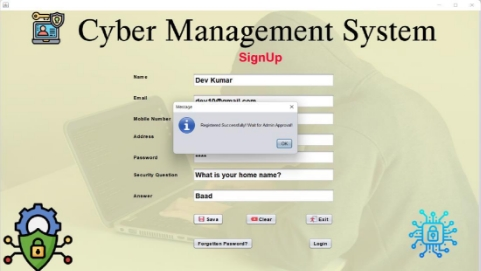
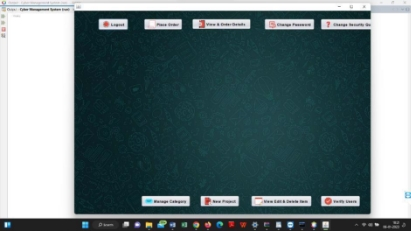
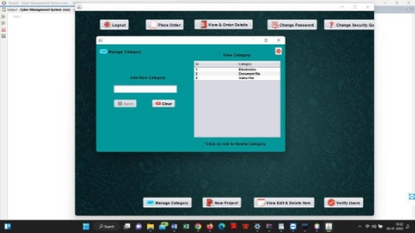
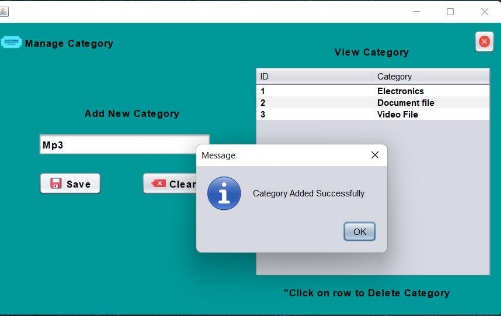
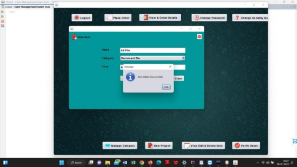
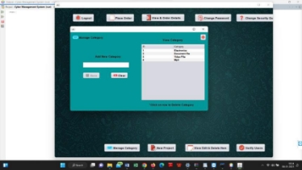
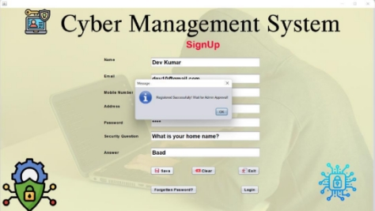


#     CYBER SECURITY MANAGEMENT
1. Introduction 

A  Digital  administration  framework  is  a  product  application  or  electronic instrument that assists Network safety with basing oversee and coordinate their assortments, track participations, and course of this product essentially making for one sort of drive and different materials. It can likewise assist web client with monitoring and break down information on their benefactors and the touchy information assets. Digital administration frameworks ordinarily incorporate an inventory of the Network safety base property, a framework for looking at and returning materials, and a data set of part data. A few frameworks may likewise offer extra highlights, for example, the capacity to put hangs on materials, pay fines,  or  access  computerized  assets,  for  example,  digital  books  or  online information bases. By and large, a Digital administration framework assists with smoothing out and work on the tasks of a Security purposes, making it more straightforward for web client to deal with their assortments and serve their benefactors.

2. Design Goals/Objective 

There are several goals and objectives that a Cyber management system might  aim to achieve: 

1. To provide a comprehensive and up-to-date catalog of the Cyber management , including Signup part, Login part, Forgotten 

   password periodicals, and other materials. 

2. To allow Login when admin approved otherwise wait for admin approval. 
2. In the Home section there are two part one is user another is admin panel. 
2. To automate and streamline the process of checking in and checking output materials. 
2. To manage and track the which member add or not add setup this maintain admin, including tracking where items are located, when they were borrowed, and when they are due to bereturned. 
2. To generate reports and statistics on the Cyber's holdings and usage  ![ref1]

   patterns. 

7. Add Item and add new product. 


# Design/Development/Implementation of the Project

 

## This is the code for signup part as well as other code also just like.

public class SignUp extends javax.swing.JFrame { 

`    `public String emailPattern = "^[a-zA-Z0-9]+[@]+[a-zA-Z0-9]+[.]+[a-zA-Z0-9]+$";     public String mobileNumberPattern = "^[0-9]\*$"; 

`    `public SignUp() { 

`        `initComponents(); 

`        `btnSave.setEnabled(false); 

`    `} 

`    `public void clear() { 

`        `name.setText(""); 

`        `email.setText(""); 

`        `MobileNum.setText(""); 

`        `Address.setText(""); 

`        `pass.setText(""); 

`        `question.setText(""); 

`        `answer.setText(""); 

`        `btnSave.setEnabled(false); 

`    `} 

`    `public void validateFields() { 

`        `String Name = name.getText(); 

`        `String Email = email.getText(); ![ref1]

`        `String Mobile = MobileNum.getText();         String address = Address.getText(); 

`        `String Password = pass.getText(); 

`        `String SecurityQuestion = question.getText();         String Answer = answer.getText(); 

`        `if (!Name.equals("") && Email.matches(emailPattern) && Mobile.matches(mobileNumberPattern) && Mobile.length() == 11 && !address.equals("") && !Password.equals("") && !SecurityQuestion.equals("") && !Answer.equals("")) { 

`            `btnSave.setEnabled(true);         } else { 

`            `btnSave.setEnabled(false);         } 

`    `} 

private void btnSaveActionPerformed(java.awt.event.ActionEvent evt) {                                                 // TODO add your handling code here: 

`        `User user = new User(); 

`        `user.setName(name.getText()); 

`        `user.setEmail(email.getText()); 

`        `user.setMobileNum(MobileNum.getText()); 

`        `user.setAddress(Address.getText()); 

`        `user.setPassword(pass.getText()); 

`        `user.setSecurityQuestion(question.getText());                  

`    `user.setAnswer(answer.getText()); 

`        `UserDao.save(user); 

`        `clear(); 

`    `} 

package dao; 

import java.sql.\*; 

public class ConnectionProvider { 

`    `public static Connection getCon(){ 

`        `try{ 

`            `Class.forName("com.mysql.cj.jdbc.Driver"); 

`            `Connection con=DriverManager.getConnection("jdbc:mysql://localhost:3306/cyber?useSSL=fals e","root","12345"); 

`            `return con; 

`        `} ![ref1]

`        `catch(ClassNotFoundException | SQLException e){              return null; 

`        `} 

`    `} 

} 

package dao; 

import java.awt.HeadlessException; 

import javax.swing.JOptionPane; 

import java.sql.\*; 

public class DbOperations { 

`    `public static void setDataOrDelete(String Query, String msg) {         try { 

`            `Connection con = ConnectionProvider.getCon(); 

`            `Statement st = con.createStatement(); 

`            `st.executeUpdate(Query); 

`            `if (!msg.equals("")) { 

`                `JOptionPane.showMessageDialog(null, msg); 

`            `} 

`        `} catch (HeadlessException | SQLException e) { 

`            `JOptionPane.showMessageDialog(null, e, "Message", JOptionPane.ERROR\_MESSAGE); 

`        `} 

`    `} 

`    `public static ResultSet getData(String query) { 

`        `ResultSet rs = null; 

`        `try { 

`            `Connection con = ConnectionProvider.getCon();             Statement st = con.createStatement(); 

`            `rs = st.executeQuery(query); 

`        `} catch (SQLException e) { 

`            `JOptionPane.showMessageDialog(null, e, "Message", JOptionPane.ERROR\_MESSAGE); 

`        `} 

`        `return rs;     } 

} 

# Algorithm 

Step 1: Start the program. 

Step 2: Display the login panel and prompt the user to enter their username and password. 

Step 3: Verify the username and password. 

Step 3.1: If the username and password are correct, proceed to the main menu. 

- If the username and password are incorrect, display an error message and return to the login panel. 

Step 4: Display the main menu with the following options: 

- Login section 
- Signup section 
- Forget Password section 
- Home Section 
- Manage Category 
- Item add 

Step 5: Prompt the user to choose an option from the main menu. 

Step 6: If the user chooses the "Signup section": 

Step 6.1: Display a submenu with the following options: 

- Add new category 
- Delete category 
- Display category 
- Update category information 

Step 6.2: Prompt the user to choose an option from the submenu. 

Step 6.3: If the user chooses to "Add new item": 

- Prompt the user to input the category's information. 
- Store the category's information in the database. 
- Return to the main menu. 

Step 6.4: If the user chooses to "Delete category": 

- Prompt the user to input the category's information or search for the category. ![ref1]
- Delete the category's information from the database. 
- Return to the main menu. 

Step 6.5: If the user chooses to "Display categories": 

- Display the list of all categories in the database. 
- Return to the main menu. 

Step 6.6: If the user chooses to "Update item information": 

- Prompt the user to input the category's information or search for the category. 
- Update the category's information in the database. 
- Return to the main menu. 

Step 7: If the user chooses the "User section": 

Step 7.1: Display a submenu with the following options: 

- Add new user 
- Delete user 
- Display users 
- Update user information 

Step 7.2: Prompt the user to choose an option from the submenu. 

- If the user chooses to "Add new user": 
- Prompt the user to input the user's information. 
- Store the user's information in the database. 
- Return to the main menu. 

Step 7.3: If the user chooses to "Delete user":

- Prompt the user to input the user's information or search for the user. 
- Delete the user's information from the database. 
- Return to the main menu.

Step 7.4: If the user chooses to "Display users":

- Display the list of all users in the database.
- Return to the main menu. 

Step 7.5: If the user chooses to "Update user information": 

- Prompt the user to input the user's information or search for the user.
- Update the user's information in the database. 
- Return to the main menu. 

Step 8: If the user chooses the "User section": 

- Display a submenu with the following options: 
- Add new User 
- Delete User
- Display Users 
- Update User information

 Prompt the user to choose an option from the submenu.
 If the user chooses to "Add new User": 

- Prompt the user to input the User's information. 

▪  Store the User's 

Chapter 3 

Performance evaluation 

3.1  Results and Discussions 

3.1.1  Results 

To start my Cyber management system, first, he will have to login into the admin section and user section is same but when email comes to admin email same the login email this is go to the admin panel and others panel. 


Figure 1: Admin Section ![ref1]



Figure 2: Signup in 

- On the home page, he will get three buttons: the book button, the user button, and finally, he will get the User button. All three of these buttons will take them to separate pages, and he will enter all the information that will be asked. 



Figure 4: Home section 

- When the admin enters into the Home section, he then can easily update any new item and category and so on, or he can also easily update new information on the pattern, and he can also search the information. It will also store in the database as a backend so that the information is always saved. ![ref1]





Figure 5: Manage Category section ![ref1]



Figure 6: New Item data save 



Figure 7: New Item added successfully ![ref1]

- When the admin enters the User section, he can enter all the user' entities and how many a user value look data section. 


Figure 8: User information![ref1]

14 | P a g e 

- When the admin or others user enters the  section, he then can easily recover his/her password respect to email and security Question answer. Here he can update password data. 



Figure 9: Forget Password section. 


# Introduction

A  Digital  administration  framework  is  a  product  application  or electronic instrument that assists Network safety with basing oversee and coordinate their assortments, track participations, and course of this product essentially making for one sort of drive and different materials. It  can  likewise  assist  web  client  with  monitoring  and  break  down information on their benefactors and the touchy information assets. Digital administration frameworks ordinarily incorporate an inventory of the Network safety base property, a framework for looking at and returning materials, and a data set of part data. A few frameworks may likewise offer extra highlights, for example, the capacity to put hangs on materials, pay fines, or access computerized assets, for example, digital  books  or  online  information  bases.  By  and  large,  a  Digital administration framework assists with smoothing out and work on the tasks of a Security purposes, making it more straightforward for web client to deal with their assortments and serve their benefactors.

# Practical Implications 

There are several steps involved in implementing a Cyber management system  in a practical setting: 

1. Identify  the  needs  and  goals  of  the  Cyber.  This  will  help  to determine  the specific  features  and  functions  that  the  cyber management system should included. 
1. Research and evaluate different cyber management systems. This may include reviewing product demonstrations, reading ![ref2]

reviews and case studies, and speaking with other cyber that have implemented similar systems. 

3. Choose a cyber management system that meets the needs and goals of the cyber, and that is within budget. 
3. Install and set up the cyber management system. This may involve configuring the system to work with the cyber's existing hardware and software, and importing data from the cyber's current catalog. 
3. Train cyber staff on how to use the cyber management system. This may involve providing hands-on training sessions or creating instructional materials for staff to reference. 
3. Id out the cyber management system to patrons. This may involve introducing new self-service kiosks or updating the cyber's website toallow patrons to search for and request materials online. 
3. Monitor and maintain the cyber management system. This may involveregularly backing up data, applying updates and patches, and troubleshooting any issues that may arise. 
2. Scope of Future Work 

There are several areas where future work could be focused in a cyber management system project. 

1. Integration with other systems: A Cyber management system could be integrated with other systems, such as a private user information system or a financial management system, to allow for a more seamless and efficient workflow 
2. Mobile access: Developing a mobile app or improving mobile accessto the library management system could make it easier for patrons to access and use the system from their phones or other mobile devices. 
2. Enhanced search and discovery: Adding features such as faceted search or natural language processing could help patrons to more easily find the materials they are looking for within the library's collection. 
2. Personalization  and  recommendation:  Implementing personalized recommendations or custom reading lists based on a  patron's interests and past borrowing history could help to improve the user experience and encourage repeat use of the cyber. 

5. Data analytics: Leveraging data from the library management system to gain insights into usage patterns and trends could help the library to make informed decisions about its collection and services. 
5. Cut to order and other functionalliltise.
 

# References

1. [Y.  Daniel  Liang  Java  programming  Book  Chapter  32  Database programming ](file:///C:/New%20folder%20\(2\)/Introduction_to_java_programming_by_Y_Daniel_Liang_10th_edition.pdf) 
1. [https://www.javatpoint.com ](https://www.javatpoint.com/)
1. Java_the complete reference, ninth edition 
1. [https://www.programiz.com/java-programming ](https://www.programiz.com/java-programming)
1. https://github.com/ 


## How to run this Project
- Go  to Messenger/src/Chat  folder
- Find the server dot java file
- First of all run the server dot java file then 
- Run user1 and user2 
- But reminder that sometimes shows some error because you need to connect any local server. Then this error do not shows next time

- You can run same way for Group chatting Part in the project.


## You can find project proposal [.png>)](https://drive.google.com/file/d/1_1Oxb6741qBSkTIQCDXBQs51YS1d6ID9/view?usp=sharing)

## Code of Sources

To deploy this project run

```bash
  Messenger/src/Chat
```
```bash
  Group Chatting Application/src/group/chatting/application
```


## Social

[](https://www.youtube.com/@pan78mtricks)

[](https://www.facebook.com/pankaj.mahanto.78)

[](linkedin.com/in/pankaj-mahanto78/)

[](https://x.com/mahanto_pankaj?t=uSysV9y-QMHIzqo-PIL3sA&s=08)


## Authors

[.png>)](https://www.github.com/pankaj-arya)

[](https://www.google.com/gmail)
# You can find project report [.png>)](https://drive.google.com/file/d/1_1Oxb6741qBSkTIQCDXBQs51YS1d6ID9/view?usp=sharing)


